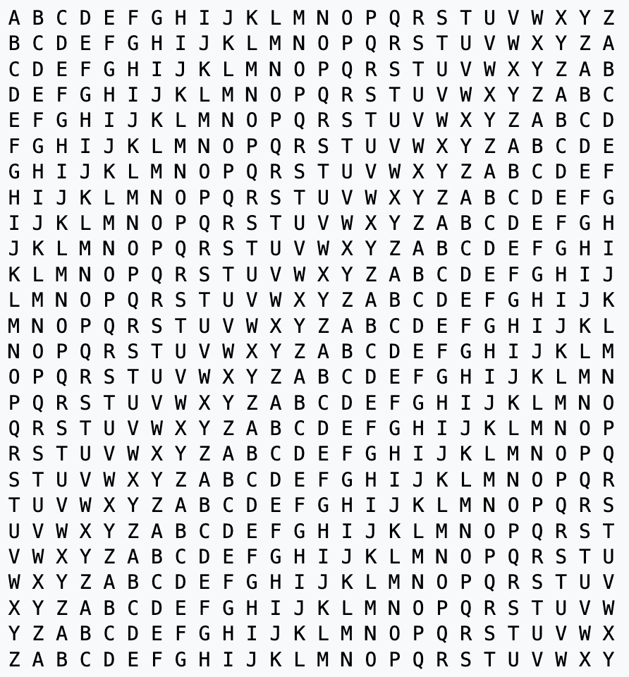

# 123 Encryption Schemes
___
## Background
Cryptography (not to be confused with crypto and blockchain) is a branch of Computer Science and Mathematics concerned with turning input messages (plaintexts) into encrypted ones (ciphertexts) that allow for safe transfer past adversaries. The most modern and secure of these protocols are heavily influenced by advanced mathematical concepts such that they can be proven to leak 0 information about the plaintext. As the Internet itself consists of sending messages through other devices to reach an eventual endpoint, this feature is crucial! Without it, much of the Internet we take for granted would be impossible to implement safely (giving credit card info to retailers, authenticating senders, secure messaging, etc.)

## Assignment
For this assignment, you'll be required to implement a number of [classical ciphers](https://en.wikipedia.org/wiki/Classical_cipher) making use of your knowledge of abstract classes and inheritence to reduce redundancy whenever possible. Once completed, you should be able to encode information past the point of any human being able to easily determine what the input plaintext was!

That being said, the course staff would like to reinforce a message commonly said by the security and privacy community: **"Never roll your own crypto"**. In other words, **do not** use this assignment in any future applications where you'd like to encrypt some confidential user information. Classical ciphers are known to be remarkably weak against the capabilites of modern computation and thus anything encrypted with them should not be considered secure.
___
## Code
Below is a description of the encryption schemes you're required to implement in this assignment:
___
### Ceaser.java
The Ceaser Cipher is likely the most commonly known encryption algorithm. It consists of assigning each input character a unique output character, and replacing all characters appropriately when encoding / decoding. This mapping is provided via a shifter string. Vertically aligning this shifter string with the alphabet and looking at the corresponding columns allows us to see the appropriate character mappings. Consider the following example:

alpha   = "ABCDEFG"

shifter = "GCBEAFD"

Given the shifter string above, the plaintext "FAD" would be encoded into "FGE" and decoding the ciphertext "CGE" gives the plaintext "BAD". Your solution must implement the following methods:

```java
public Ceaser()
```
Constructs a new Ceaser Cipher with an empty shifter

```java
public Ceaser(String shifter)
```
Constructs a new Ceaser Cipher with the provided shifter. Should throw an `IllegalArgumentException` if the length of the shifter doesn't match number of characters handled by our Ciphers or any individual character falls outside our range of valid characters.

```java
public setShifter(String shifter)
```
Updates the shifter for this Ceaser Cipher. Should throw an `IllegalArgumentException` if the length of the shifter doesn't match the number of valid characters handled by our Ciphers or any individual character falls outside our range of valid characters.

Since we're allowing clients to set a shifter after construction, your `handleInput` method should throw an `IllegalStateException` if a shifter was never set (and thus no encryption/decryption can occur).
___
### CeaserShift.java

This encryption scheme is extremely similar to the one described above, except it involves shifting the entire alphabet forwards (or backwards) by the provided shift amount. Consider the following example:

alpha   = "ABCDEFG"

shift   = 3

shifter = "EFGABCD"

Note that the shifter string consists of the alphabet with each character shifted forwards 3 places (looping back to the beginning if required). Below is the method signature for the classes' constructor:

```java
public CeaserShift(int shift)
```
An `IllegalArgumentException` should be thrown in the case that shift is 0 (as no encryption would be occuring).

**HINT**: One way of viewing the modulo operator (%) is that it shrinks our integer numberline to one having a certain length (i.e. %10 only allows numbers +/- 0-9 to exist). This is useful in situations where we want to loop back to the beginning after passing a specific value and will likely be useful in your solution to the above.
___
### CeaserKey.java

Much like the CeaserShift, the CeaserKey scheme also builds off of the base Ceaser Cipher. Namely, this one involves a key that is placed at the front of the shifter string, with the rest of the alphabet following normally (minus the characters included in the key). Consider the following example:

alpha = "ABCDEFG"

key = "BAG"

shifter = "BAGCDEF"

Note that the shifter string starts with "BAG" (the key) and then is followed by the alphabet in its original order (minus the characters B, A, and G as they're already in the shifter). Below is the method signature for the classes' constructor:
```java
public CeaserKey(String key)
```
This constructor should throw an `IllegalArgumentException` in the case that the key is empty, it contains a character outside our range of valid characters, or it contains any duplicate characters.
___
### MultiCipher.java
The above ciphers are interesting, but on their own they're pretty solvable. A more complicated approach would be to chain these ciphers together to really confuse any possible adversaries! This is what you'll be implementing in this class: given a list of ciphers, use all of them them in order to encrypt / decrypt a message. Below is the appropriate method signature for the constructor:
```java
public MultiCipher(List<Cipher> ciphers)
```
An `IllegalArgumentException` should be thrown in the case that the list is empty (as no encryption would be occuring).
___
## Creative Portion
For the creative portion of this assignment, you'll be implementing another cipher that interests you! Below is the recommended list:

1) [Concealment](https://en.wikipedia.org/wiki/Classical_cipher#Concealment_ciphers)
2) [Vigenere](https://en.wikipedia.org/wiki/Classical_cipher#Substitution_ciphers)
3) [Transposition](https://en.wikipedia.org/wiki/Classical_cipher#Transposition_ciphers)
4) CeaserRandom
5) Your choice!

___
### 1. Concealment

This scheme involves confusing any potential adversary with a jumble of random characters, and placing the important characters at specific locations within the encrypted message. For example, looking at the character following four filler characters in the below string reveals the message:

k:w'[S]()\[_`j[E]()?T\[k[C]()zU=L[R]()h;5k[E]()o]R8[T]()

SECRET

Your solution should contain the following constructor:
```java
public Concealment(int filler)
```
An `IllegalArgumentException` should be thrown in the case that filler is not positive.
___
### 2. Vigenere

The Vigenère cipher is a hybrid between the CeaserKey and CeaserShift. It is created with a key that is repeated such that its length matches that of the input text:

input = "HELLO"

key = "CSE"

repeatKey = "CSECS"

This value at each position of this key then determines the CeaserShift to use for a specific character. If you imagine that the example above is only using uppercase alphabetic characters, that would mean index 0 would shift by 2 (c - a), index 1 would shift by 18 (s - a), index 2 would shift by 4 (e - a), and so on. This would leave us with the following ciphertext.

cipher = "JWPNG"

Another way to envision this is using a Vigenère square pictured below



To encode, use the current key character to determine the row (total shift value) and the current input character at the top of the square to determine the column. To decode, again use the current key character as the row, but this time determine the column from the row itself. Following the column to the top shows the correct decoded character.

**Before continuing**, trace through the above example and make sure you understand how to encode and decode an input given a key. What changes when we are considering more than just alphabetic characters?

Below is the appropriate constructor signature for your solution:

```java
public Vigenere(String key)
```
An `IllegalArgumentException` should be thrown if the key is empty, or if it contains only `Cipher.MIN_CHAR` (as no encryption will occur).
___
### 3. Transposition

Unlike our previous ciphers, a transposition cipher involves shuffling the position of characters rather than substituting them with new ones. Most of these involve creating a grid with a certain width, filling it in with an input string, and then traversing the grid in a different way to get the encryption. For example:

input = "HELLO"

width = 2

grid = \[\['H', 'E'\], \['L', 'L'\], \['O', ' '\]\]

cipher = "HLOEL "

Here, the grid was filled in by traversing rows, and the cipher was created by traversing columns. Decrypting would involve the opposite, filling in the grid by traversing columns, and creating the plaintext by traversing rows. Alternative traversals are possible, but we recommend this approach as it is the easiest to implement.

Below is the appropraite constructor signature for your solution:
```java
public Transposition(int width)
```
An `IllegalArgumentException` should be thrown if the width is <= 0 (not possible) or == 1 (as no encryption will occur).

**HINT**: Given an input string, you'll likely want to make sure it is a length that's a multiple of width by padding with spaces (this avoids null/empty values in your grid). When decrypting, just make sure to remove these spaces that were added before returning (take a look at the String's `trim` method).
___
### 4. CeaserRandom
Here, you'll implement another variation of a Ceaser Cipher that uses a randomly shuffled shifter string. This initially sounds impossible as if we randomly create the shifter string, how do we possibly decrypt? The answer lies in being able to control a Random object in java via a seed value. Any two Random objects constructd with the same seed will produce random values in the same order as one another. Below is an example:
```java
int seed = 123;
Random rand = new Random(seed);
Random rand2 = new Random(seed);
System.out.println(rand.nextInt(10) == rand2.nextInt(10));
```
Thus, if you know the seed used to randomly create a shifter string, you can recreate it when decrypting. Your solution should store this seed somewhere in the encrypted message such that it is retreivable on decryption (i.e. front, end, etc.).

**HINT**: There exists a method that will shuffle the values of a list with a given random object called `Collections.shuffle(list, rand)`. You may use this if you'd like.

The length of the seed will be determined by a number of digits provided by the constructor. It is your choice if you want to include leading 0's in the number of digits a number has. Alternatively stated, you get to pick whether given 3 digits if the smallest number will be 000 or 100.

Below is the appropriate constructor signature for your solution:

```java
public CeaserRandom(int digits)
```
An `IllegalArgumentException` should be thrown if digits isn't positive or if it is greater than the max number of digits for an integer, which is 9. (Note that the max integer value is 2,147,483,647 which is 10 digits, but larger 10-digit numbers can't be represented).
___
### 5. Your choice!

Here, you'll implement an encryption scheme that sounds most interesting to you! There are no constraints on this option, other than your encryption scheme must be 1:1 (every output sequence must have a *single* unique input sequence).