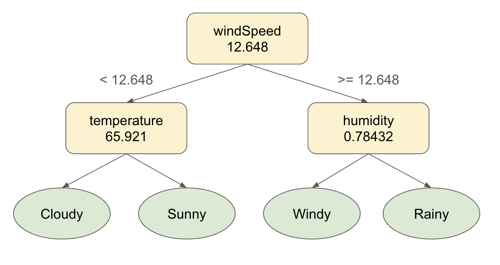
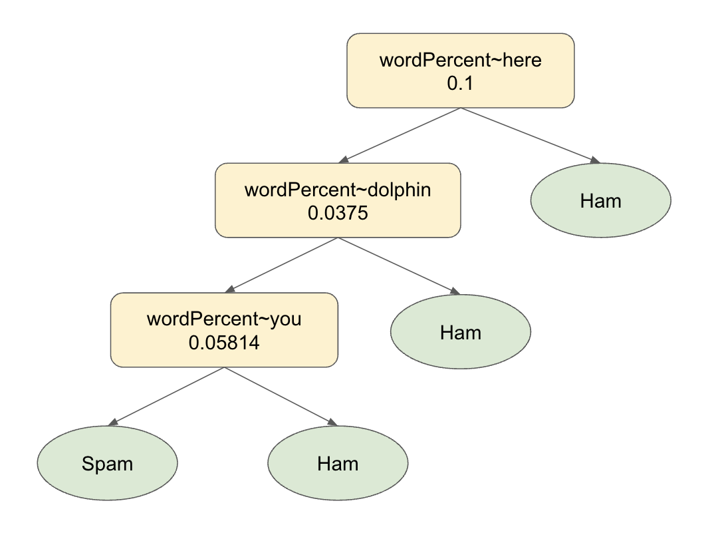

# 123 Classification Tree
___
## Background
The rise of "Machine Learning" and "Artificial Intelligence" has been hard to ignore in the past decade. While the more well-known applications include ChatGPT and Dall-E, there are a number of other uses for these powerful algorithms. These include assisting biologists in the drug discovery process, helping medical professions diagnose diseases early, and predicting erratic wildfire movement to save lives.

In essence, these common buzzwords are subsets of Computer Science concerned with using trends from known inputs to predict things about unseen data. Yet, it is important to remember that these algorithms aren't magic with limitless potential - they are simply high fidelity probability models built on a vast amount of training data. This means that your predictions are only as good as the data it is built upon, which can easily be biased in some way. Thus, it is important to recognize and advocate for appropriate uses of these models, regardless of how miraculous they seem.

## Assignment

Your goal for this assignment is to implement a classification tree, a simplistic machine learning model that given some input data will predict some label for it. Below is an example relating to the weather:



As seen above, in our classification tree the leaf nodes represent our predictive labels while the intermediary nodes represent a split on some feature of our data (windSpeed, temperature, and humidity). To reach a classification for some input x, you start at the root of the tree and determine whether the appropriate feature of x falls to the left or right of the split and travel in the corresponding direction. Repeating this process will eventually lead you to a classification for your input. Below we'll trace through an input with our weather example.

x = (windSpeed=10.214, temperature=72.210, humidity=0.41234)

* Since the windSpeed feature of x is less than the threshold (12.648) we'll travel left to the temperature node
* Since the temperature feature of x is >= 65.921 we'll travel right to the Sunny node
* We have reached a leaf node and thererefore can predict that x corresponds to a sunny day

In this assignment, you'll be writing a classification tree implementation and using it to predict given some email predict whether it's "spam" or "ham", and potentially extend this to a dataset of your choice! Below is an example of a potential classification tree created by our model.



Note that for simplicity the only feature we'll be exploring is the percentage of certain words within our emails, named wordPercent. In the example above, an email input will only be classified as spam given <10% of the words are "here", <3.75% of the words are "dolphin", and <5.814% of the words are "you".
___
## Code
There's a decent amount of starter code, so here is a description of each of the classes and how they relate to one another
___
### Split
`Split` is a wrapper class that stores a feature and threshold for any intermediary node within our tree. Below are the methods it implements

```java
public double getThreshold()
```
Returns the threshold of this split.

```java
public String getFeature()
```
Returns the feature name without any specific component tied to it. In the case of our email example it would return "wordPercentage" without the specific word tied to it (instead of "wordPercentage~dolphin")

```java
public boolean evaluate(Classifiable value)
```
Returns whether or not the given value falls below the threshold of this split (i.e. whether or not you should travel left or right in a classification tree).

```java
public String toString()
```
Returns a String representation of the given Split. This consists of the feature information on the first line and the threshold on the second.
___
### Classifiable
This is an abstract class that any data we wish to classify must extend. Although there is a reason for it being an abstract class that will be discussed in the creative portion, for all intents you can consider it an interface as it defines three abstract methods that any datapoint must implement.

```java
public abstract double get(String feature);
```
Gets the corresponding value for the given feature. Although there are classification trees where it would make sense to return something else (imagine a color feature within a ____ dataset), since you're only dealing with thresholds this must return a double.

```java
public abstract List<String> getFeatures();
```
Returns a list of all features for a given dataset. This is useful in determining whether or not this datapoint can be classified by a `Classifier`.

```java
public abstract Split partition(Classifiable other);
```
Returns a partition or `Split` between this datapoint and other. How this computed is  up to the implementer (and is a large part of the complexity of our model).

A simple example for all above implementations an be seen in the provided `Email` class. Here the only feature we're concerned with is the percentage of any word contained within the original email appropriately named "wordPercent". Note that for any split, we need to also keep track of the specific word assigned to it. We do this by appending said word after the feature name with some arbitrary split character (i.e. "wordPercentage~hello" refers to the percentage of "hello"s contained with the email). This character is determined by a constant within the `Classifiable` class

```java
public static final String SPLITTER;
```
Alternatively phrased, in the case that a feature doesn't relate to one specific aspect of our dataset, this String is used to differentiate between the feature name and the specifc aspect of the feature we're interested in.

There also exists a dictionary constant to be used in potential creative extensions.

```java
public static final Set<String> DICT;
```

**At this point, stop and think!** What is a feature? What is a threshold? What is a label? How can you easily determine a split between two points in our dataset?
___
### Classifier
Now, we'll move into the code you're required to implement for this assignment. This is another abstract class that your classification tree will extend. It defines a number of methods that are required to be considered a "Classifier":

```java
public boolean canClassify(Classifiable input);
```
Given a piece of classifiable data, returns whether or not this tree is capable of classifying it.

You can imagine that it wouldn't make much sense to try and run an email input through our weather classifier above, which is why this method is useful!

```java
public String classify(Classifiable input);
```
Given a piece of classifiable data, return the appropriate label that this classifier predicts. If the input is unable to be classified by this classifier, this method should throw an `IllegalArrgumentException`.

This method should model the steps taken in our weather example above: at every split point, evaluate our input data and determine if its less than our threshold. If so, continue left - otherwise continue right. Repeat this process until a leaf node is reached.

```java
public void save(PrintStream ps);
```
Saves this current classifier to the given PrintStream.

For our classification tree, this format should be pre-order. Every intermediary node will print two lines of data (one for feature and one for threshold). For leaf nodes, you should only print the label.

Note that this class also implements a `calculateAccuracy` method that returns the model's accuracy on all labels in a provided testing dataset. This is useful to see how well our model actually works, and what labels it is struggling with classifying.

You'll also have to implement two constructors for your Classification Tree, not listed in the interface
```java
public ClassificationTree(Scanner sc)
```
Load the classification tree from a file connected to the given Scanner. You may assume that the format of the input file matches that of the `save` method described above. Importantly, in this method you should only read data from the file using `nextLine` and convert it to the appropriate format using `Double.parseDouble`.

```java
public ClassificationTree(List<Classifiable> data, List<String> results)
```
Create a classification tree from the input data and corresponding labels. This should be accomplished via the algorithm described below:

1) Traverse through the current classification tree until you reach a leaf node. If the label matches, do nothing (our model is accurate up to this point).
2) If the label is incorrect, create a split between the data used to create the original leaf node* and our current input.
3) Insert a new intermediary node that uses the previously created split to correctly classify the new data.

*Note that ideally we'd like to keep track of all input data that falls under a specific leaf node such that when creating a new split, we can make sure it's valid for our entire dataset. For simplicity, only worry about the first datapoint used to create a label node.

Once those methods are implemented, you'll have a working classifier! Try it out using `Client.java` and see how well it does (what is it's accuracy on our test data). Also, try saving your tree to a file and see what it looks like. Is it splitting on features you'd expect? Why or why not? (Note that this is a big area of current CS research called "explainable AI" - how can we interpret the results from these massive probability models that are often difficult for humans to understand).
___
## Creative Portion
For this assignment, there are 3 recommended creative extensions you can implement:
1) Add more features to the current model.
2) Extend the Classifiable class for a dataset of your choosing.
3) Create a classification forest.

All of these are described more in depth below.
___
### 1. Add more features to the current model.
Our current model has ~60-70% accuracy, which is better than a coin flip but could use some improvement. Your job is to add an additional feature (or features if you so choose) to the `Email` class. Some ideas include:

1) Character percentage.
2) Removing special characters from input
3) Special character percentage.
4) Valid english word percentage (using `Classifiable.DICT`)
5) Your choice!

Note that we recommend whatever feature you add is also a percentage. Doing so will simplify the logic within `partition()` as it will be easier to compare to the existing wordPercent feature. However, you are welcome to consider additional features that interest you and experiment with weighting their importance in the partition differently.

Your additions are also not required to *improve* the model in terms of its overall accuracy. If you find that your addition causes your model to perform worse, we'd encourage you to think about why that might be the case! (Does more information always mean a better model? Are you potentially removing some important information?)
___
### 2. Extend the Classifiable class for a dataset of your choosing.
Note that our `Classifier` can work on anything that extends the `Classifiable` class. Let's try it out with some more interesting data! In this extension you'll take an existing dataset, load it into a list of `Classifiable` objects and see how well our model works. Below is a list of datasets we'd recommend messing around with (although you're welcome to explore whatever interests you)
1) Weather (./data/weather/weather.csv) - predict summary from temperature, humidity, wind speed, etc.
2) Spotify (./data/songs/spotify_songs.csv) - predict popularity from danceability, energy, key, etc.
3) Your choice! (It might be worth checking out a website like https://www.kaggle.com/datasets?tags=13302-Classification). When exploring these datasets, consider whether a machine learning model is actually the best solution to a problem or if it has the potential to do more harm than good.

Make sure that the dataset you choose has features that are ints/doubles such that they are able to be classified by our threshold splits! You'll also have to make some changes to `Client.java` to load your dataset into whatever `Classifiable` class you write. We'd recommend changing out all instances of the `toEmails` method with a similar one that constructs the object that you write.
___
### 3. Create a classification forest
Classification trees are models that tend to overfit to the training data they're built on - you can imagine that a model that creates a split for every single piece of input data will perfectly classify the input data but likely struggle on any unseen datapoints. One way to counteract this is to create something called a forest. Forests average out the results from a many trees, picking the label that appears most frequently. In this extension, you'll be creating a `ClassificationForest` class that embodies this concept. Namely, you should run an input through a provided number of trees and pick the label that appears most often, breaking ties arbitrarily.

Your new `Classifier` must extend the corresponding abstract class and include the following constructors:

```java
public ClassificationForest(int n, List<Classifiable> data, List<String> labels)
```
Construct a forest with `n` trees from the provided data and labels. Note that in order for this to be a valid forest of different trees, you must shuffle the data and labels the *same* way between tree construction (see `Client.java` for an example).

```java
public ClassificationForest(Scanner sc)
```
Construct a forest from a scanner attached to a file. The first line of the file should be the total number of trees within the forest. Everything following is the stored tree data formatted as per the `ClassificationTree`'s `save` method. Your forest's save method should follow this format as well. Note that like our tree's Scanner constructor you should only be reading data from the scanner using `nextLine` and converting it to the appropriate data type using `Integer.parseInt`

Once you've created your new model, change uncomment the corresponding lines in `Client.java` to test out it's accuracy. Does it perform better than a single tree like we'd expect? (It's ok if it doesn't!)